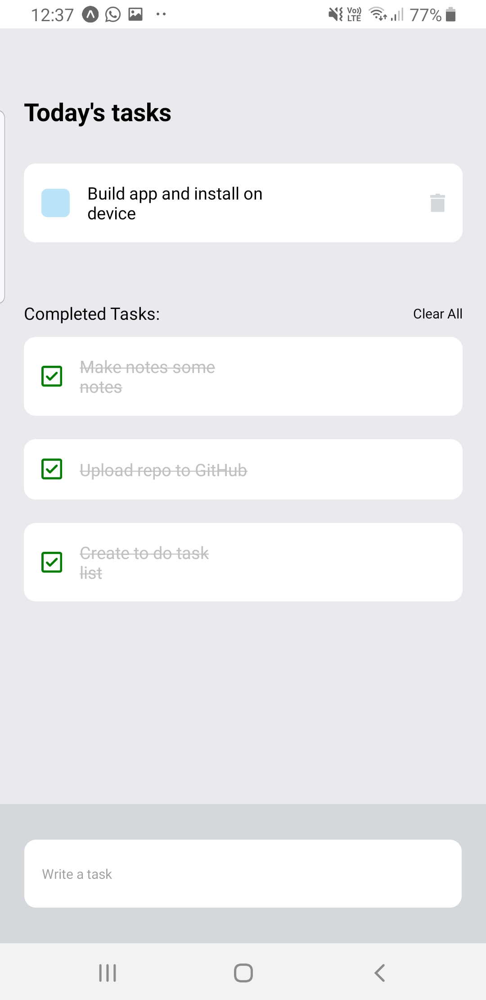

# To Do List Example

Getting started with React Native using Expo, I wanted to create a very basic app that helps with something I do every day, make a task list!

## Table of contents

- [The challenge](#the-challenge)
- [My process](#my-process)
  - [Built with](#built-with)
  - [What I learned](#what-i-learned)
  - [Continued development](#continued-development)
  - [Useful resources](#useful-resources)
- [Author](#author)

## The challenge

Users should be able to:

- Add a new task to the list
- View all tasks added
- Remove any tasks they dont need to do
- Mark a task as completed
- See a list of completed tasks 
- Clear the list of completed tasks

## Screenshot

## My process

### Built with

- [Expo](https://docs.expo.dev/) - Expo

### What I learned

- Installation of Expo 
- Getting started with React Native (Views, Text, TouchableOpacity) 
- Using Styled Components

### Continued development

Moving forward with this app (or another idea), I would like to:

- Add user authentication
- Connect to an API 
- Explore more React Native components

## Author

- Website - [Rich Griffiths](https://richardgriffiths-portfolio.netlify.app/)

